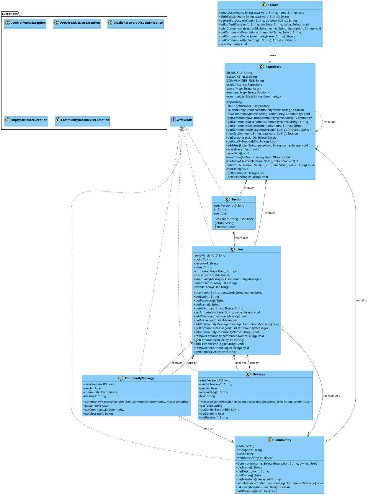

# Jackut - Social Networking Platform

## Project Overview

Jackut is a Java-based social networking platform that enables users to create profiles, connect with friends, join communities, and exchange messages. The system is designed with a clean architecture that separates concerns and promotes maintainability.



## Features

- **User Management**: Create and manage user profiles with customizable attributes
- **Authentication**: Secure login system with session management
- **Communities**: Create, join, and interact in interest-based communities
- **Messaging**: Exchange direct messages with other users
- **Community Messaging**: Share messages with all members of a community

## System Architecture

Jackut follows object-oriented design principles and implements several design patterns:

### Key Components

1. **Facade (`Facade` class)**
    - Provides a simplified interface to the system
    - Entry point for all external interactions

2. **Data Repository (`Repository` class)**
    - Implements the Singleton pattern
    - Manages persistence of users, sessions, and communities
    - Handles data loading and saving

3. **User Model (`User` class)**
    - Represents user profiles with attributes
    - Manages user relationships and messaging

4. **Community Model (`Community` class)**
    - Represents interest groups
    - Manages membership and community-wide messaging

5. **Messaging System**
    - `Message` class for direct user-to-user communication
    - `CommunityMessage` class for community-wide announcements

### Persistence

The system uses Java serialization to persist data in three files:
- `jackut_users.dat`: Contains user data
- `jackut_sessions.dat`: Contains active session information
- `jackut_communities.dat`: Contains community data

## Setup and Usage

### Prerequisites

- Java Development Kit (JDK) 8+
- EasyAccept testing framework (included)

### Building the Project

1. Clone the repository
2. Compile the Java files:
   ```
   javac -cp .:easyaccept.jar src/br/ufal/ic/p2/jackut/*.java src/Main.java
   ```

### Running the Tests

The project includes EasyAccept tests that validate the functionality:

```
java -cp .:easyaccept.jar:src Main
```

This will run all the acceptance tests defined in the `tests` directory.

## API Reference

### User Management

```java
// Create a new user
createUser(login, password, name)

// Start a user session
abrirSessao(login, password)

// Get user profile attribute
getAtributoUsuario(login, atributo)

// Edit user profile
editarPerfil(sessionId, attribute, value)
```

### Community Management

```java
// Create a new community
criarComunidade(sessionId, name, description)

// Get community description
getCommunityDescription(communityName)

// Get community owner
getCommunityOwner(communityName)

// Get communities a user belongs to
getCommunitiesByUser(login)
```

### System Administration

```java
// Delete all data from the system
eraseSystem()
```

## Exception Handling

The system defines several exceptions to handle error conditions:

- `UserNotFoundException`: When attempting to access a non-existent user
- `UserAlreadyExistsException`: When attempting to create a duplicate user
- `InvalidPasswordOrLoginException`: When authentication fails
- `EmptyAttributeException`: When required attributes are empty
- `CommunityDoesntExistException`: When attempting to access a non-existent community

## Testing

The project uses the EasyAccept framework for acceptance testing. Test scripts are located in the `tests` directory and define use cases for the system:

- User account creation and authentication (US1)
- Profile management (US2)
- Community creation and management (US3-9)

## Project Structure

```
src/
??? Main.java                       # Main entry point for testing
??? br/ufal/ic/p2/jackut/
?   ??? Community.java              # Community model
?   ??? CommunityMessage.java       # Community messaging
?   ??? Exceptions/                 # Exception classes
?   ??? Facade.java                 # System facade
?   ??? Message.java                # Direct messaging
?   ??? Repository.java             # Data storage and management
?   ??? Session.java                # User session management
?   ??? User.java                   # User model
tests/
??? us1_1.txt, us1_2.txt, etc.      # EasyAccept test scripts
```
